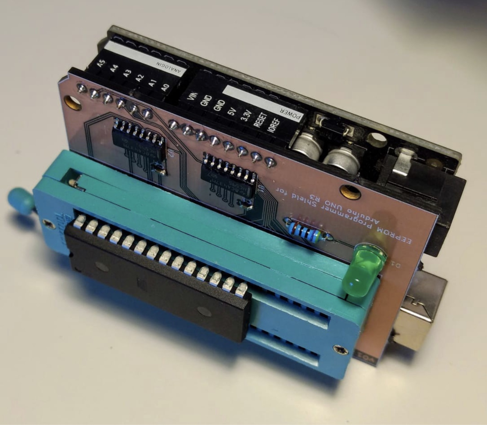
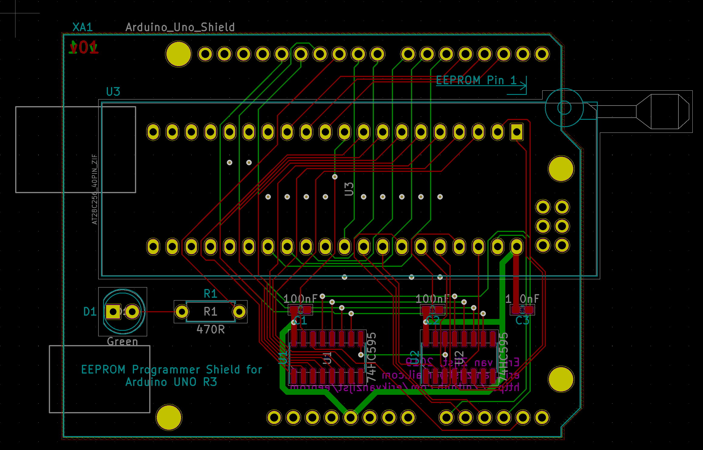

Parallel EEPROM Programmer
==========================

This is a Shield extension board for Arduino UNO R3 that adds the ability to
read and write parallel EEPROM chips.



This repository contains:

* Arduino code
* Interactive Python based client to read and write to the EEPROM
* KiCad scehmatic and PCB

## Installation and assembly

Install [platformio](https://platformio.org) to compile and upload the firmware
to the Arduino:

    $ platformio run --target upload

Order the PCB either directly from
[Oshpark](https://oshpark.com/shared_projects/gB4fefq3), or use the included
[Gerber files](gerbers/) with any other board house.

With the shield attached to the Uno and hooked up to a computer, fire up the
Python client. To write an image to the EEPROM:

```
$ source ./env/bin/activate
$ cat image.bin | ./eeprom.py load 
Loading 400 bytes into EEPROM...
100%
Complete.
$
```

Full writeup is at https://medium.com/@erikvanzijst/diy-eeprom-programmer-4fd11a486ea




The PCB can be ordered from
[OSH Park](https://oshpark.com/shared_projects/gB4fefq3).

[](https://travis-ci.org/erikvanzijst/eeprom)
